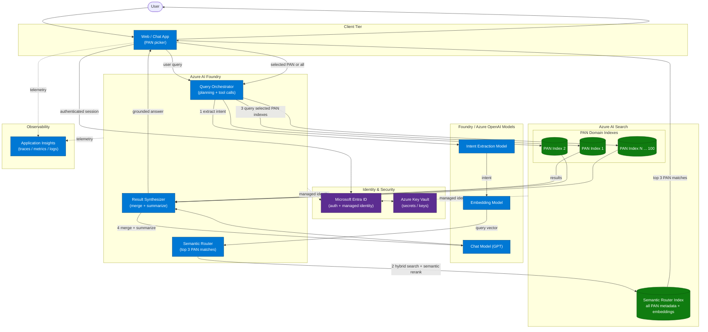

## Overview

An Azure AI Foundry application orchestrates the request. A user submits a query, a model extracts the intent, and the intent is converted into embeddings. Azure AI Search then performs hybrid search with semantic reranking against a semantic router index that represents all PAN domain indexes. The router returns the top 3 PAN matches, the user chooses one PAN or all of them, and the system queries the associated domain indexes. The results are merged, summarized, and returned to the user.

Microsoft Entra ID secures user and service access, Key Vault stores residual secrets, and Application Insights captures telemetry.

## Architecture diagram

## Request flow

1. The user submits a query through the web or chat frontend.
2. The orchestrator extracts intent from the query.
3. The orchestrator converts the intent to embeddings.
4. Azure AI Search hybrid search with semantic reranking runs against the semantic router index.
5. The router returns the top 3 PAN matches.
6. The user selects one PAN or chooses all of them.
7. The orchestrator queries the domain indexes associated with the selected PAN or PANs.
8. The synthesizer merges and summarizes the retrieved results.
9. The chat model prepares the final grounded response and the frontend renders it to the user.

## Component responsibilities

| Component | Responsibility |
| --- | --- |
| Web / Chat App | Accepts the query, presents the top 3 PAN matches, collects the selection, and renders the final answer |
| Query Orchestrator | Coordinates intent extraction, routing, selection handling, and retrieval |
| Intent Extraction Model | Infers the user intent from the incoming query |
| Embedding Model | Converts the extracted intent into embeddings for semantic routing |
| Semantic Router | Uses Azure AI Search hybrid search with semantic reranking to return the top 3 PAN matches |
| Semantic Router Index | Stores metadata and embeddings for all PAN domain indexes |
| PAN Domain Indexes | Store the searchable content for each PAN |
| Result Synthesizer | Merges the retrieved results and produces a concise summary |
| Chat Model | Produces the final grounded response text |
| Entra ID + Managed Identity | Authenticate users and authorize service-to-service calls |
| Key Vault | Stores secrets and keys |
| Application Insights | Captures traces, metrics, and logs |

## Key design notes

* The router now stops at the top 3 PAN matches and waits for user confirmation before any domain retrieval starts.
* The semantic router index holds metadata for all PAN domain indexes, which keeps the shortlist focused and searchable.
* Hybrid search with semantic reranking gives the router both lexical precision and semantic recall.
* Fan-out is deferred until the user selects a PAN or chooses all, which avoids unnecessary retrieval work.
* Managed identity remains the default for Foundry-to-Azure communication.

## Open considerations

* Define the exact shape of the intent schema so routing and telemetry use the same fields.
* Decide whether the UI should show short descriptions for each PAN match or only the PAN names.
* Confirm the merge strategy for the all selection path when more than one PAN is queried.
