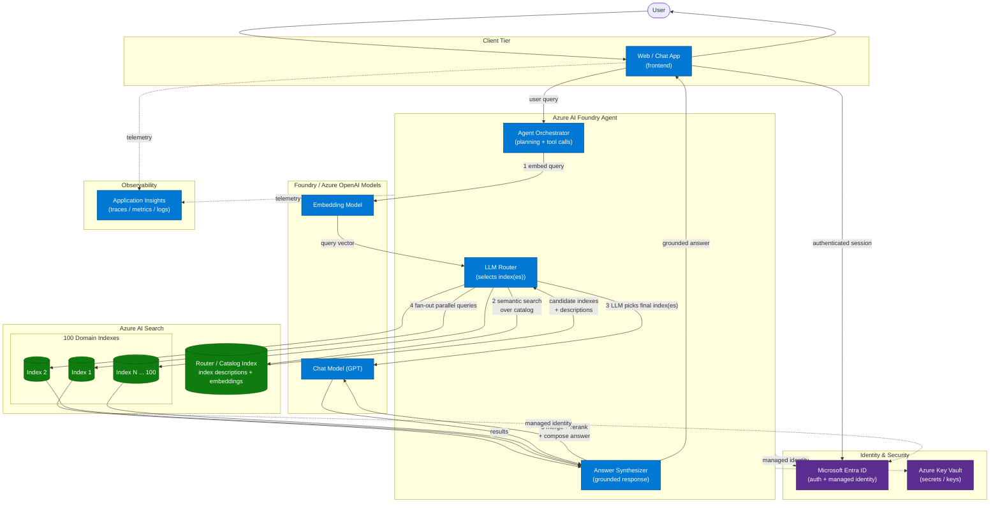

# Agentic Router Architecture — Azure AI Foundry + Azure AI Search

An Azure AI Foundry agent acts as the orchestrator. For each query it embeds the user
question, queries a dedicated router/catalog index to shortlist candidates from the 100
domain indexes, then an LLM router selects the final index(es). Selected indexes are
queried in parallel (fan-out), results are merged and reranked, and the chat model
composes a grounded answer. Microsoft Entra ID and managed identity secure all calls,
Key Vault holds secrets, and Application Insights captures telemetry.

## Architecture diagram



  ## Sequence diagram

  ```mermaid
  sequenceDiagram
    autonumber
    actor User
    participant Web as Web / Chat App
    participant Entra as Microsoft Entra ID
    participant Orch as Agent Orchestrator
    participant Embed as Embedding Model
    participant Catalog as Router / Catalog Index
    participant Router as LLM Router
    participant Domain as Domain Indexes
    participant Synth as Answer Synthesizer
    participant Chat as Chat Model (GPT)
    participant Appi as Application Insights

    User->>Web: Submit query
    Web->>Entra: Authenticate session
    Entra-->>Web: Token / claims
    Web->>Orch: Forward authenticated query
    Orch->>Embed: Embed user question
    Embed-->>Orch: Query vector
    Orch->>Catalog: Semantic shortlist lookup
    Catalog-->>Orch: Candidate indexes + descriptions
    Orch->>Router: Ask model to select final index(es)
    Router->>Chat: Reason over candidates
    Chat-->>Router: Selected index set

    par Fan-out to selected indexes
      Router->>Domain: Query index 1
    and
      Router->>Domain: Query index 2
    and
      Router->>Domain: Query index N
    end

    Domain-->>Synth: Search results
    Synth->>Chat: Merge, rerank, and draft answer
    Chat-->>Synth: Grounded response draft
    Synth-->>Web: Final answer
    Web-->>User: Display response

    Orch-->>Appi: Trace request lifecycle
    Web-->>Appi: UI telemetry
  ```

## Request flow

1. The user submits a query through the web/chat frontend, authenticated via Microsoft Entra ID.
2. The Foundry agent orchestrator embeds the query using the embedding model.
3. The router runs a semantic search over the router/catalog index to shortlist candidate indexes.
4. The LLM router reasons over the candidate descriptions and selects the final index(es).
5. The router fans out parallel queries to the selected domain indexes (1 to N of 100).
6. The synthesizer merges and reranks the results, then the chat model composes a grounded answer.
7. The answer returns to the frontend and the user.

## Component responsibilities

| Component | Responsibility |
| --- | --- |
| Web / Chat App | Entry point, user session, auth handoff |
| Foundry Agent Orchestrator | Plans the request, invokes tools, coordinates routing and synthesis |
| LLM Router | Selects the target index(es) from catalog candidates |
| Router / Catalog Index | Holds descriptions and embeddings for all 100 indexes for fast shortlisting |
| Domain Indexes (100) | Hold the actual searchable content per domain |
| Embedding + Chat Models | Generate query vectors and compose grounded answers |
| Entra ID + Managed Identity | Authenticate users and authorize service-to-service calls |
| Key Vault | Stores secrets and keys |
| Application Insights | Captures traces, metrics, and logs |

## Key design notes

- **Two-stage routing** keeps the design scalable to 100 indexes: a cheap semantic
  shortlist from the catalog index narrows the field, then the LLM makes the final,
  explainable pick. This avoids placing all 100 descriptions into a single prompt.
- **Fan-out and merge** supports queries that span multiple domains. Reranking with the
  Azure AI Search semantic ranker consolidates results before synthesis.
- **Managed identity everywhere** removes keys from the agent. Key Vault holds only
  residual secrets.

## Further considerations

- **Reranking approach**: Azure AI Search built-in semantic reranker (native, simple) or
  LLM-based rerank (higher quality, higher cost). Recommendation: start with the native
  semantic reranker.
- **Catalog freshness**: keep the router/catalog index in sync as domain indexes change.
  Recommendation: event-driven updates on index lifecycle changes.
- **Fan-out limits**: cap the number of indexes queried per request to bound latency and
  cost. Recommendation: configurable top-K with a default of 3.
