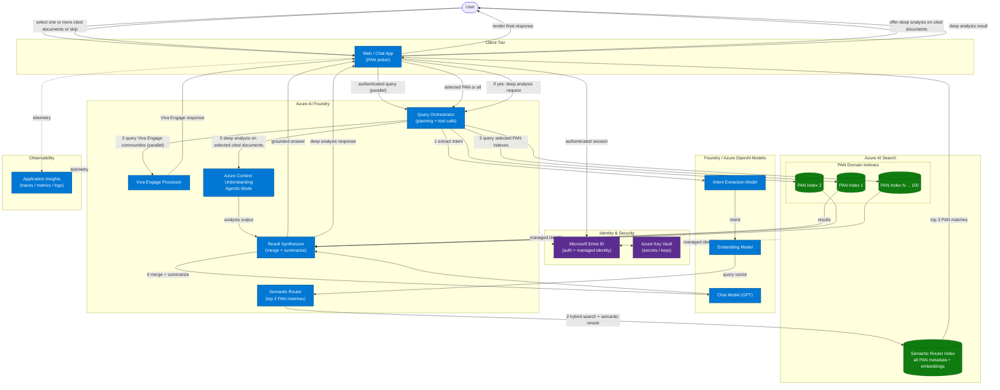
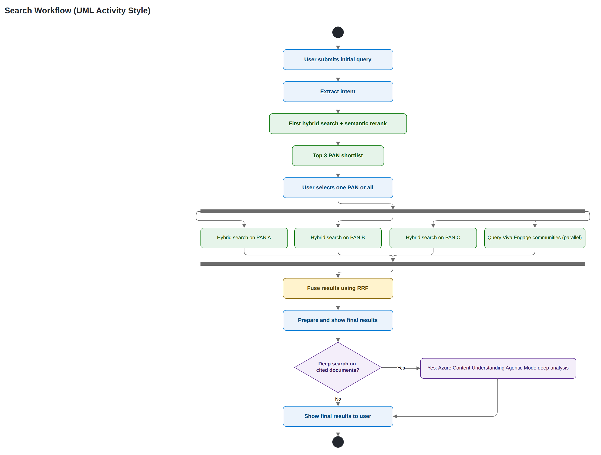
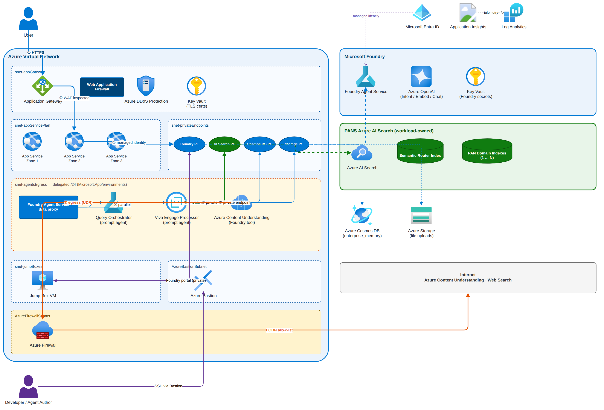

## Overview

An Azure AI Foundry application orchestrates the request. A user submits a query, a model extracts the intent, and the intent is converted into embeddings. Azure AI Search then performs hybrid search with semantic reranking against a semantic router index that represents all PAN domain indexes. The router returns the top 3 PAN matches, the user chooses one PAN or all of them, and the system dispatches parallel post-selection work: query selected PAN domain indexes and query Viva Engage communities through the Viva Engage Processor. The PAN branch is merged, summarized, and returned to the user. The Viva branch returns as a separate response stream. After the final response is rendered, the frontend offers an optional deep analysis action on one or more cited documents. If the user answers yes, the orchestrator invokes Azure Content Understanding Agentic Mode and returns a deep-analysis response.

Microsoft Entra ID secures user and service access, Key Vault stores residual secrets, and Application Insights captures telemetry.

## Architecture diagram

## Search workflow diagram

The workflow below is a simple UML activity-style diagram that expands the routing and retrieval path from initial query through optional deep analysis. It keeps the user PAN selection step and makes post-selection parallel execution explicit: PAN hybrid search fan-out plus Viva Engage community query in parallel.

## Request flow

1. The user submits a query through the web or chat frontend.
2. The orchestrator extracts intent from the query.
3. The orchestrator converts the intent to embeddings.
4. Azure AI Search hybrid search with semantic reranking runs against the semantic router index.
5. The router returns the top 3 PAN matches.
6. The user selects one PAN or chooses all of them.
7. After selection, the orchestrator dispatches parallel work to PAN retrieval and Viva Engage retrieval.
8. The orchestrator runs hybrid search on the selected PAN domain indexes in parallel.
9. The Viva Engage Processor queries Viva Engage communities in parallel.
10. The orchestrator fuses the parallel PAN results with Reciprocal Rank Fusion (RRF).
11. The synthesizer merges and summarizes the RRF-fused PAN results.
12. The chat model prepares the final grounded response and the frontend renders it to the user.
13. The frontend asks whether the user wants deep analysis on one or more cited documents and captures the user choice.
14. If the user answers yes, the frontend sends the selected cited documents to the orchestrator for deep analysis.
15. The orchestrator runs Azure Content Understanding Agentic Mode on the selected cited documents and returns a deep-analysis response to the frontend.
16. The Viva Engage Processor independently returns a Viva Engage response to the frontend.
17. The chat app presents both response streams: final or deep-analysis response and Viva Engage response.

## Component responsibilities

| Component | Responsibility |
| --- | --- |
| Web / Chat App | Accepts the query, presents the top 3 PAN matches, collects the selection, renders the final answer, and offers optional deep analysis on cited documents |
| Query Orchestrator | Coordinates intent extraction, routing, selection handling, PAN retrieval, and final or deep-analysis response generation |
| Viva Engage Processor | After PAN selection, queries Viva Engage communities in parallel and returns a separate Viva Engage response |
| Azure Content Understanding Agentic Mode | Performs deep analysis on user-selected cited documents when the user answers yes |
| Intent Extraction Model | Infers the user intent from the incoming query |
| Embedding Model | Converts the extracted intent into embeddings for semantic routing |
| Semantic Router | Uses Azure AI Search hybrid search with semantic reranking to return the top 3 PAN matches |
| Semantic Router Index | Stores metadata and embeddings for all PAN domain indexes |
| PAN Domain Indexes | Store the searchable content for each PAN |
| Result Synthesizer | Merges and summarizes RRF-fused PAN retrieval results |
| Chat Model | Produces the final grounded response text |
| Entra ID + Managed Identity | Authenticate users and authorize service-to-service calls |
| Key Vault | Stores secrets and keys |
| Application Insights | Captures traces, metrics, and logs |

## Key design notes

* The router now stops at the top 3 PAN matches and waits for user confirmation before any domain retrieval starts.
* The semantic router index holds metadata for all PAN domain indexes, which keeps the shortlist focused and searchable.
* Hybrid search with semantic reranking gives the router both lexical precision and semantic recall.
* Fan-out is deferred until the user selects a PAN or chooses all, which avoids unnecessary retrieval work.
* After user selection, hybrid search runs in parallel across selected PAN indexes and the orchestrator fuses the result sets with Reciprocal Rank Fusion (RRF).
* The Viva Engage branch starts after the user selects one PAN or all and runs in parallel with selected PAN index retrieval.
* The Viva Engage Processor queries Viva Engage communities in parallel and returns an independent response stream.
* After the final response is rendered, the user can optionally select one or more cited documents for deeper analysis.
* The deep-analysis branch only executes when the user answers yes, and it is processed through Azure Content Understanding Agentic Mode.
* The frontend receives two separate outputs: PAN final or deep-analysis response and Viva Engage response.
* Managed identity remains the default for Foundry-to-Azure communication.

## Open considerations

* Define the exact shape of the intent schema so routing and telemetry use the same fields.
* Decide whether the UI should show short descriptions for each PAN match or only the PAN names.
* Confirm the merge strategy for the all selection path when more than one PAN is queried.
* Define how the chat app should prioritize or layout two separate response streams when both branches complete at different times.
* Confirm how the optional deep-analysis action should be surfaced in the UI when multiple cited documents are available.
* Define timeout and fallback behavior if Azure Content Understanding Agentic Mode does not complete in the expected latency window.
* Confirm delegated permissions and data-governance boundaries for authenticated Viva Engage query processing.

## Deployment view

This section describes the Azure infrastructure layer required to host the PANS solution. The topology follows the
[Baseline Microsoft Foundry Chat Reference Architecture](https://learn.microsoft.com/en-us/azure/architecture/ai-ml/architecture/baseline-microsoft-foundry-chat):
BYO virtual network, Foundry Agent Service standard agent setup, private endpoints throughout, Application Gateway
with WAF as the sole public entry point, and Azure Firewall for agent egress control.

### Infrastructure workflow

1. The user sends HTTPS requests to Azure Application Gateway. Web Application Firewall inspects each request and
   Azure DDoS Protection mitigates volumetric attacks before traffic reaches App Service.
2. The App Service-hosted chat UI calls Foundry Agent Service over a private endpoint, authenticating with its
   system-assigned managed identity.
3. The Query Orchestrator agent queries the PANS Azure AI Search instance (semantic router index and PAN domain
   indexes) over a private endpoint.
4. The Viva Engage Processor agent runs in parallel over the same egress subnet, handling authenticated Viva
   Engage queries independently.
5. Foundry Agent Service persists conversation state (agent definitions, chat history) in Azure Cosmos DB
   (`enterprise_memory`) over a private endpoint.
6. File attachments uploaded during chat sessions are stored in Azure Storage over a private endpoint.
7. External tool calls — Azure Content Understanding Agentic Mode and the web search tool — egress through Azure
   Firewall, which enforces an FQDN allow-list before traffic reaches the internet.

Developers and agent authors access the Foundry portal through Azure Bastion and a jump box VM, reaching the
Foundry data plane via its private endpoint.

### Component mapping

| PANS component | Azure resource | Notes |
| --- | --- | --- |
| Web / Chat App | Azure App Service (3-zone redundant) | Behind Application Gateway + WAF |
| Query Orchestrator | Foundry Agent Service prompt agent | Standard agent setup, BYO VNet |
| Viva Engage Processor | Foundry Agent Service prompt agent | Parallel agent, same Foundry project |
| Semantic Router + PAN Domain Indexes | Azure AI Search (workload-owned) | Separate instance from Foundry-managed AI Search |
| Azure Content Understanding Agentic Mode | Foundry Agent Service tool | Egresses via Azure Firewall |
| Intent / Embedding / Chat models | Azure OpenAI deployed in Foundry | Private, data-zone deployment |
| Agent conversation state | Azure Cosmos DB (`enterprise_memory`) | Managed exclusively by Foundry Agent Service |
| File uploads during chat | Azure Storage | Managed exclusively by Foundry Agent Service |
| TLS certificates for App Gateway | Azure Key Vault (App Gateway vault) | Dedicated; not shared with Foundry |
| Foundry tool connection secrets | Azure Key Vault (Foundry vault) | Dedicated; not shared with App Gateway |
| Telemetry | Application Insights + Log Analytics | All services emit diagnostics |
| User and service identity | Microsoft Entra ID + managed identities | System-assigned per service |

### Key hosting design notes

* One dedicated Foundry resource is deployed per production workload (fully isolated topology), keeping compliance
  scope, blast radius, and quota separate from other workloads and pre-production environments.
* The PANS Azure AI Search instance (semantic router index and PAN domain indexes) is a workload-owned resource,
  separate from the AI Search instance that Foundry Agent Service manages for its own agent state.
* `snet-agentsEgress` is a `/24` subnet delegated to `Microsoft.App/environments`. Foundry Agent Service deploys
  one data proxy per project; both the Query Orchestrator and the Viva Engage Processor share that proxy.
* All PaaS service communication uses private endpoints. Public access to the Foundry data plane is disabled.
* Azure Firewall enforces an FQDN allow-list for all outbound agent traffic. The allow-list must include the
  Azure Content Understanding service endpoints.
* WAF exclusions are required for the chat message body field. Code snippets, SQL, and HTML in user prompts
  trigger false positives across multiple managed rule categories.
* Zone redundancy targets: App Service (3 availability zones), AI Search (3 replicas), zone-redundant Storage,
  Cosmos DB with availability zones enabled, Azure Firewall across all availability zones.
* Conversation ownership must be enforced at the App Service layer on every request. Trusting client-supplied
  conversation identifiers without server-side validation creates a Broken Object Level Authorization (BOLA)
  vulnerability.
